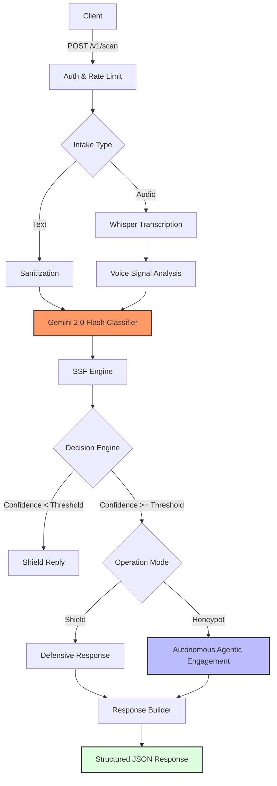

<!-- Generate a professional, judge-friendly root README.md based strictly on the following context. This is a high-level API showcase, not a technical deep dive. -->
# BlockSafe
*Agentic AI system for real-time scam detection & intelligence extraction*

<p align="center">
  
  
  
  
  
  
  
  
</p>

🔒🚀 BlockSafe is a production-grade, agentic AI service that flags scams in real time, fingerprints tactics, and responds in Shield or Honeypot modes—built to impress hackathon judges and API consumers in under 30 seconds.

## 🎯 What BlockSafe Does
- 🎙️ Accepts text or audio inputs.
- 🧠 Detects scams using Gemini 2.0 Flash.
- 🪪 Generates Scam Strategy Fingerprints (SSF).
- 🛡️ Operates in Shield mode (defensive) or 🍯 Honeypot mode (intelligence extraction).
- 📦 Returns deterministic JSON for evaluation.

## ⚡ API First — Quick Start
**Base URL:** `https://api.blocksafescan.ai`  
**Auth header:** `X-API-KEY: <YOUR_API_KEY>`
- 🔑 API key is required.
- 🧾 Responses are JSON.
- ♻️ Stateless design.

Example request (conceptual):
```http
POST /v1/scan HTTP/1.1
Host: api.blocksafescan.ai
X-API-KEY: <YOUR_API_KEY>
Content-Type: application/json

{ "input": "voice or text payload", "mode": "shield|honeypot" }

```

## 🗺️ Architecture (High-Level)


## 📁 Repository Structure
/
├── server/        # Backend implementation (detailed README inside)
├── .github/       # CI/CD workflows
├── docker/        # Docker-related files (optional grouping)
├── README.md      # This file

- Server README contains full technical details.
- Root README is intentionally high-level.

## 🐳 Docker Support
- Dockerfiles are provided for containerized deployment.
- `.dockerignore` keeps images lean.
- Cloud-ready footprint.

## 🤖 CI/CD Support
- GitHub Actions workflows live under `.github/workflows`.
- CI validates Python version, dependency install, and app startup sanity for judge reproducibility.

## 🛡️ Security & Ethics
- No data is stored; processing is stateless.
- Honeypot mode is bounded and controlled.
- Designed for defensive cybersecurity research.

## 📣 Call to Action
See `server/README.md` for full technical implementation.  
Designed for hackathons, extensible for production.
