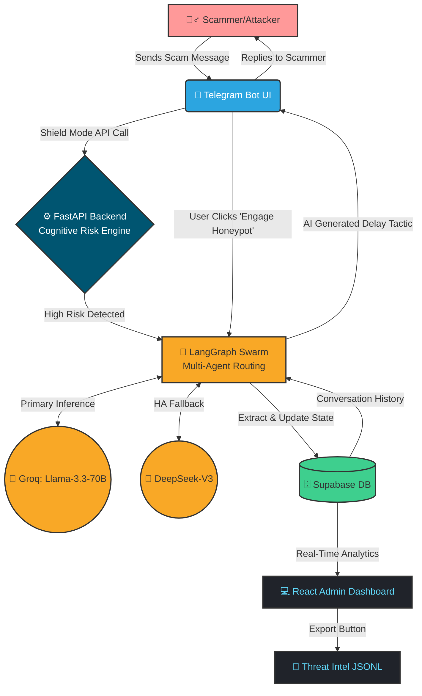

<div align="center">

# 🛡️ BlockSafe
**An Autonomous Cognitive Firewall & Threat Intelligence Engine**

[](https://python.org)
[](https://fastapi.tiangolo.com/)
[](https://reactjs.org/)
[](https://docker.com)
[](https://supabase.com)
[](https://core.telegram.org/bots)

> *"Security today protects devices. Scams attack humans. BlockSafe protects the human decision layer."*

</div>

---

## 🛑 The Problem

Spam filters block links. Antivirus blocks malware. But neither stops a human from making an irreversible decision when manipulated by fear, urgency, or authority. 

Scams succeed in the **30–90 seconds** of panic before a user realizes they are being deceived. 

## 💡 Our Solution: The Cognitive Firewall

BlockSafe is not a spam filter. It is an **Autonomous Cognitive Firewall**. 
It intervenes *before* the user acts, neutralizes the attacker through controlled honeypot engagement, and converts every attack into a high-fidelity intelligence dataset.

### ✨ Key Features
* 🧠 **Cognitive Risk Engine**: Detects psychological manipulation (urgency, fear, authority) rather than just keyword matching.
* 🛑 **Pre-Action Intervention**: Pauses outgoing risky messages and provides users with a calm, persuasive explanation of the threat.
* 🤖 **Autonomous Honeypot**: Takes over the conversation from the user via our Telegram Bot, deploying delay tactics to extract threat intelligence from the scammer.
* 🔗 **Conversation Continuity**: Uses Supabase to maintain state, ensuring the AI remembers context throughout the engagement.
* 📊 **Threat Intelligence Command Center**: A React dashboard to monitor live attacks, network risk scores, and threat distribution.
* 🏭 **Dataset Generation Engine**: Automatically formats neutralized honeypot engagements into ML-ready datasets (Threat Intel JSON & Fine-Tuning JSONL).

---

## 🏗️ System Architecture

BlockSafe is built using a highly decoupled, asynchronous microservice architecture, utilizing **Groq's LPUs** for sub-second inference with a high-availability fallback to **DeepSeek**.


```mermaid
---
id: 1536703f-d656-4a1a-8075-bba44db560a7
---
graph TD
    classDef user fill:#ff9999,stroke:#333,stroke-width:2px;
    classDef bot fill:#2CA5E0,stroke:#333,stroke-width:2px,color:#fff;
    classDef backend fill:#005571,stroke:#333,stroke-width:2px,color:#fff;
    classDef ai fill:#f9a826,stroke:#333,stroke-width:2px;
    classDef db fill:#3ECF8E,stroke:#333,stroke-width:2px;
    classDef frontend fill:#20232a,stroke:#333,stroke-width:2px,color:#61dafb;

    A[🦹‍♂️ Scammer/Attacker]:::user -->|Sends Scam Message| B(📱 Telegram Bot UI):::bot
    
    B -->|Shield Mode API Call| C{⚙️ FastAPI Backend\nCognitive Risk Engine}:::backend
    
    C -->|High Risk Detected| D[🧠 LangGraph Swarm\nMulti-Agent Routing]:::ai
    D <-->|Primary Inference| G((🚀 Groq: Llama-3.3-70B)):::ai
    D <-->|HA Fallback| DS((🐋 DeepSeek-V3)):::ai
    
    D -->|Extract & Update State| F[(🗄️ Supabase DB)]:::db
    F -->|Conversation History| D
    
    B -->|User Clicks 'Engage Honeypot'| D
    D -->|AI Generated Delay Tactic| B
    B -->|Replies to Scammer| A
    
    F -->|Real-Time Analytics| H[💻 React Admin Dashboard]:::frontend
    H -->|Export Button| I[📄 Threat Intel JSONL]:::frontend
```

---

## 🛠️ Tech Stack

* **Backend Engine:** Python, FastAPI, LangGraph, LangChain
* **Primary AI Inference:** Groq (`llama-3.3-70b-versatile`) for ultra-low latency.
* **Fallback AI Inference:** DeepSeek (`deepseek-chat`) for high-availability redundancy.
* **State Management:** Supabase (PostgreSQL)
* **Frontend Intervention:** `python-telegram-bot` (Async API)
* **Command Center UI:** React, Vite, Tailwind CSS, Recharts
* **Infrastructure:** Docker & Docker Compose (Ready for Render Deployment)

---

## 🚀 Running Locally (Dockerized Environment)

BlockSafe is fully containerized into three distinct microservices. You can spin up the entire ecosystem on your local machine using Docker.

### 1. Prerequisites

* [Docker Desktop](https://www.docker.com/products/docker-desktop/) installed and running.
* A Telegram Bot Token (from [@BotFather](https://t.me/botfather)).
* Supabase API URL and Service Role Key.
* API Keys for Groq and DeepSeek.

### 2. Environment Setup

Clone the repository and set up your environment variables:

```bash
git clone [https://github.com/bhargava562/block-safe.git](https://github.com/bhargava562/block-safe.git)
cd block-safe

```

Create a `.env` file in the `server/` directory using the provided template:

```env
# ─────────────────────── REQUIRED ───────────────────────
API_AUTH_KEY=your-secure-api-key-here

# ─────────────────────── AI API KEYS ───────────────────────
GROQ_API_KEY=your-groq-api-key-here
DEEPSEEK_API_KEY=your-deepseek-api-key-here

# ─────────────────────── SUPABASE (State) ───────────────
SUPABASE_URL=your-project-url.supabase.co
SUPABASE_SERVICE_KEY=your-service-role-key-here

# ─────────────────────── MODEL NAMES ────────────────────
GROQ_MODEL=llama-3.3-70b-versatile
DEEPSEEK_MODEL=deepseek-chat

# ─────────────────────── HONEYPOT Configuration ─────────
HONEYPOT_MAX_TURNS=5
HONEYPOT_CONFIDENCE_THRESHOLD=0.85

```

### 3. Spin Up the Containers

Run Docker Compose to build and start all three services (FastAPI, Telegram Bot, and React Dashboard):

```bash
docker-compose up --build

```

### 4. Access the Services

* 🌐 **FastAPI Swagger Docs**: `http://localhost:8000/docs`
* 📱 **Telegram Bot**: Open Telegram and message your bot to trigger the Cognitive Firewall.
* 💻 **Admin Dashboard**: `http://localhost:5173` (View live threats and export datasets).

---

## 🔮 What's Next (Upcoming Phase 2): The Future of BlockSafe

Our vision is to evolve BlockSafe from a conceptual Telegram demo into a ubiquitous, multi-channel cognitive firewall. Here is the roadmap for the next phase of development:

* 📱 **Native OS-Level Integration**: Transitioning from a bot interface to a background daemon/accessibility service (Android/iOS) that intercepts malicious notifications directly from WhatsApp, SMS, and native apps before the user even opens them.
* 🎙️ **Multimodal Voice Shield**: Integrating ultra-low-latency, on-device Whisper models to analyze live scam calls. BlockSafe will detect AI voice cloning, urgency manipulation, and authority impersonation in real-time, with the ability to inject an audio warning or autonomously take over the call.
* 📧 **Enterprise Email Defense**: Expanding the cognitive risk engine to parse inbound phishing emails. This includes injecting pre-action HTML intervention banners directly into the inbox and deploying automated honeypot email threads to exhaust the attacker's server infrastructure.
* 🌍 **Global Threat Intelligence Grid**: Automating the export of our `Scam Strategy Fingerprints (SSF)` via webhooks directly to banking APIs, telecom providers (like Airtel/Jio), and regulatory bodies (e.g., CERT-In) to establish a collective, pre-emptive defense network.

## 👨‍💻 The Team

Built with ❤️ and ☕ during a 24-hour hackathon by:

* **Bhargava A**
* **Bhaargav K.C**
* **Dinesh Karthik L**
* **Hari Prasanth T.S**

---

<div align="center">
<i>"We don’t just block scams. We absorb them, waste their time, and turn their strategies into intelligence."</i>
</div>
